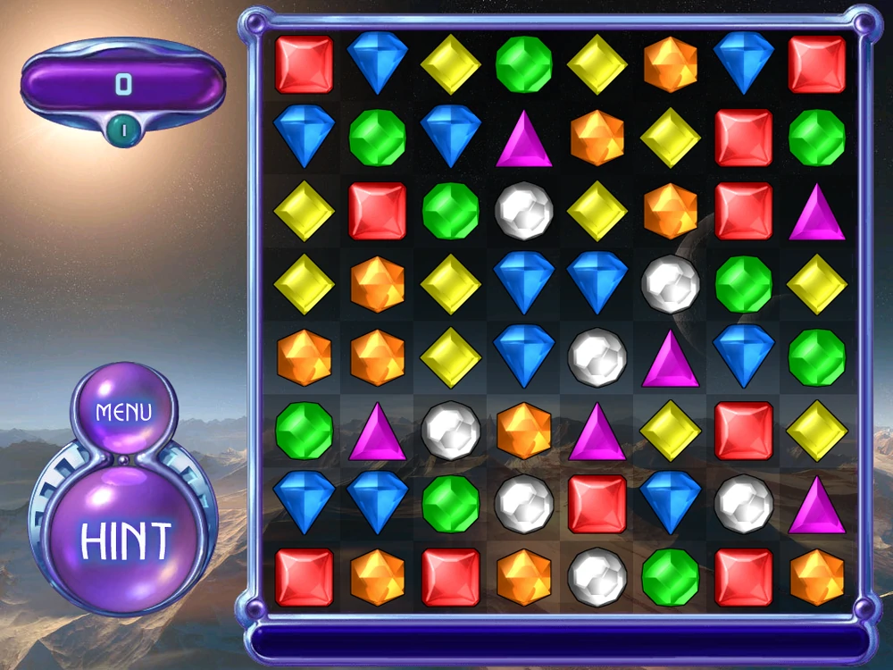
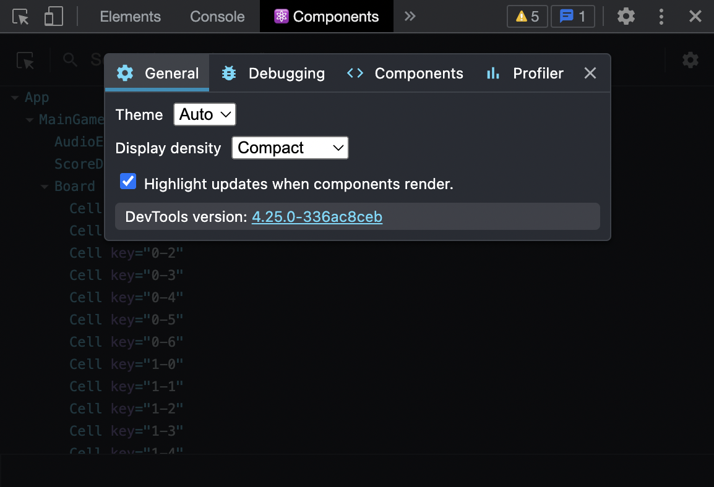

**tl;dr:** The benefits of building a project soley for learning and steps to help make sure you learn.

---

## Intro questions for the less experienced engineers

How do you learn new skills? Do you always jump to tutorials? Are you reading documentation? Finding effective ways for
you to learn, especially on your own terms, is going to greatly accelerate your career.

## Intro questions for the more experienced engineers, managers, and educators

How do you help others learn? Are you explicit or implicit about creating opportunities? "Career growth" is a constant
theme in why engineers stay at certain companies and leave others. So how do you help less experienced engineers grow
their careers?

---

My fiancé, who also happens to be a software engineer, recently told me about her team and how they get together on a
video every Friday to work on a side project together. The team is fairly small; there are two younger engineers and two
more experienced engineers, so without having talked to them directly about their motives, I'd assume it's a great
opportunity for everyone to learn and share knowledge. I thought this was a wonderful idea. As software engineers, we
are constantly expected to grow and learn, so creating this culture where learning is built into the week in a fun and
social environment sounds like a great way to achieve this without making your engineers work extra hours just to keep
up with the latest trends in technology.

I had some free time, so I took one of their projects they set aside for learning and decided to implement it on my own.
The project itself was nothing particularly special: Create a "Bejeweled" game where a player is presented a board of
gems and tasked with creating rows or columns of 3 or more matching gems. The original Bejeweled looked something like
this.

It's not your traditional "web development" project and what I made probably isn't going to impress any engineering
managers looking to potentially hire me. But working on this project got me thinking about "learning projects" in
general.

As software engineers, we're constantly expected to learn. There are always new tools coming out and old tools going out
of favor. If you went to college for computer science or went to a bootcamp, it's likely that the languages you learned
in those environments aren't going to be the only languages you use for the rest of your career. The field constantly
changes, so it's important that we learn to adapt.

Projects have been my go-to for ensuring that I learn. Following tutorials and reading documentation are great for
getting a surface-level understanding of new concepts. But by doing a project, you get a better sense of the ergonomics
of the skill you are trying to learn and a better sense of the pros and cons of the approaches you take.

In this blog post, I hope to go over tips on how I'd pick a project for the purpose of learning and criteria I'd
emphasize and de-emphasize to ensure I optimize my learning experience.

## Tip #1: Be mindful of what you want to learn and cognizant of what you don't

It should go without saying that a "learning project" should be about "learning" (or at least practicing) a new skill.
But this doesn't mean you have to learn everything and build everything from scratch. I'd say you should actively avoid
this, as you'll spend a lot of time working on parts of the project that don't actually help you learn.

Going into the Bejeweled project, I was intentional in what I wanted to practice: I wanted to try a new state management
library, [Zustand](https://github.com/pmndrs/zustand).

For other engineers, they may have other reasons for doing the project. Here is a list of skills that can be practiced
with this kind of project.

- Frontend-Specific Skills
  - Designing components: How to compose components together to create the board
  - Trying new libraries: Using React vs Vue vs Angular. Trying Redux, MobX, etc.
  - Styling the components: Using CSS or other techniques for making the app look aesthetically pleasing
  - Unit testing: Learning to use Jest or Vitest to test the logic of the app
  - Integration / E2E Testing: Learning to use Cypress / Webdriver.io to automatically use the app in the browser
- Backend-Specific Skills
  - Designing API's: Maybe you'd want to allow people to save their data. How could you support different accounts?
  - Real-time communication: Could you expand your app to have more social, real-time aspects? Could you try using tools
    like WebRTC, web sockets, etc?
- General Software Engineering Skills
  - Data Structure and Algorithms: Structuring the game data a certain way for easy manipulation; building the logic for
    determining when a move is allowed and how to score the move.
- DevOps Skills
  - Deploying the project: Picking a service to host the project
  - Automation Pipelines: Running the linting and testing

**_The important thing here is to pick one or two skills and focus on those._** Don't overload yourself. By limiting the
skill you want to practice, you can plan on how you spend your time for achieving your learning goals.

## Tip #2: Pick your project, pick your tools, and stick with them

Once you've picked what you want to learn, you need to find a project that will allow you to exercise the skills
necessary to master your topic. You'll want to pick something that is challenging enough in that one area while light
enough in other areas such that those other areas don't distract you.

If you're trying to learn a programming language, you might not even need to build a whole project. Tools like
[Code Kata](http://codekata.com/), [Leetcode](https://leetcode.com/), and [Project Euler](https://projecteuler.net/)
give you mini problems to solve that will allow you to familiarize yourself with the language's syntax and methods.
These are great because they truly allow you to isolate the specific skill you want to learn.

If you do end up building something, try to keep it light. If you're learning Ruby on Rails, you probably don't want to
rebuild the entire Netflix experience with all of its bells-and-whistles. Try to build a clone of something simple and
use the simplicity to allow you to focus on the fundamentals.

Some project ideas, in growing complexity, may include:

- A to-do list
- A calculator
- A note taking app
- An email inbox clone
- A simple Twitter clone that allows you to share anonymous tweets
- A booking website like Expedia

The Bejeweled game was a good candidate for me to learn Zustand. Storing the game state in Zustand would mean I would
get enough experience with the general API's of Zustand and learn about best practices. At the same time, it was light
in other areas. For my version, I didn't need a backend. I didn't care about high scores. And I was already comfortable
with React.

Finding a project that minimizes distractions can be largely dependent on your skills and tools that you're already
familiar with:

- create-react-app for setting up a React project with linting, formatting, and testing out of the box
- TailwindCSS for styling components quickly without having to create new files
- Jest or Vitest for quickly writing unit tests without a lot of setup

For me, choosing the right tools meant I wasted less time setting everything up and more time practicing what I wanted
to practice. **_Once you pick the tools, stick with them._** As software engineers, it can be tempting to want to try
every new shiny piece of technology. But most of the times, this just serves as a distraction from the main skill you
want to learn.

## Tip #3: Find the questions you want answered in your learning area

When you're learning something completely brand new, it can be hard to focus on what the first step is. In these
scenarios, an exercise I find helpful is to think about the various fundamentals you think you might need. For example,
say you are learning React. In general, frontend development these days is built on the following:

- How do I render a single element onto the page?
- How do I render a list of elements onto the page?
- How do I conditionally render an element? Can I show or hide certain elements based on a hardcoded true or false
  boolean?
- How can I convert my hardcoded boolean into something that is dynamic? How can I keep this in state?
- How can I modify the state? What if other parts of the code start needing to modify that state?

The great part about this list is that it can really apply to any frontend library, whether it is React, Vue, Angular,
etc.

For me, my questions were...

- How do I store state in Zustand
- How do I access that state from my React component
- When should I divide up my state?

I ran through each of these, and created mini-experiments in my app to see how these fundamentals work with Zustand.
Once I had my initial version of the app, the next step is to look at the solution and generate new questions. For
example, my next thought went into "what are the performance implications of my solution"?

I opened the React Dev Tools, and enabled the "Highlight updates when component renders" option.

From there, I played with the application.

As I clicked on a tile on the board, I noticed the entire board was outlined in green, which meant the React Dev Tool
was telling me that every single component on the board was re-rendering. This seemed excessive; if I'm clicking on one
title, only that one title should have to re-render to show that it was selected. If I'm swapping two tiles, only those
two tiles should have to re-render.

After some minor tweaks, I finally got the behavior that I wanted. Only the cells that were actually interacted with
were re-rendering.

And to me, that's one of the beauty of learning projects. You're able to able to continue learning the material at
deeper and deeper levels through a codebase you're already familiar with.

## Conclusion

Software engineering is about constantly learning and re-skilling. "Learning" a skill is itself a skill, meaning you can
think about how you go about learning and improve your ability to learn anything. Hopefully, through this blog post, you
can find new inspiration about how to think about your learning process and find new ways to focus your projects to
achieve your goals.
